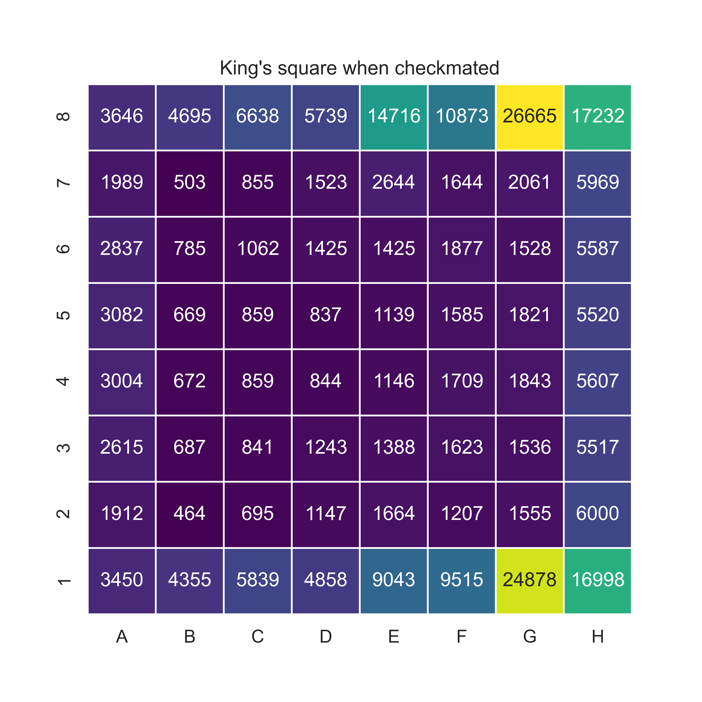
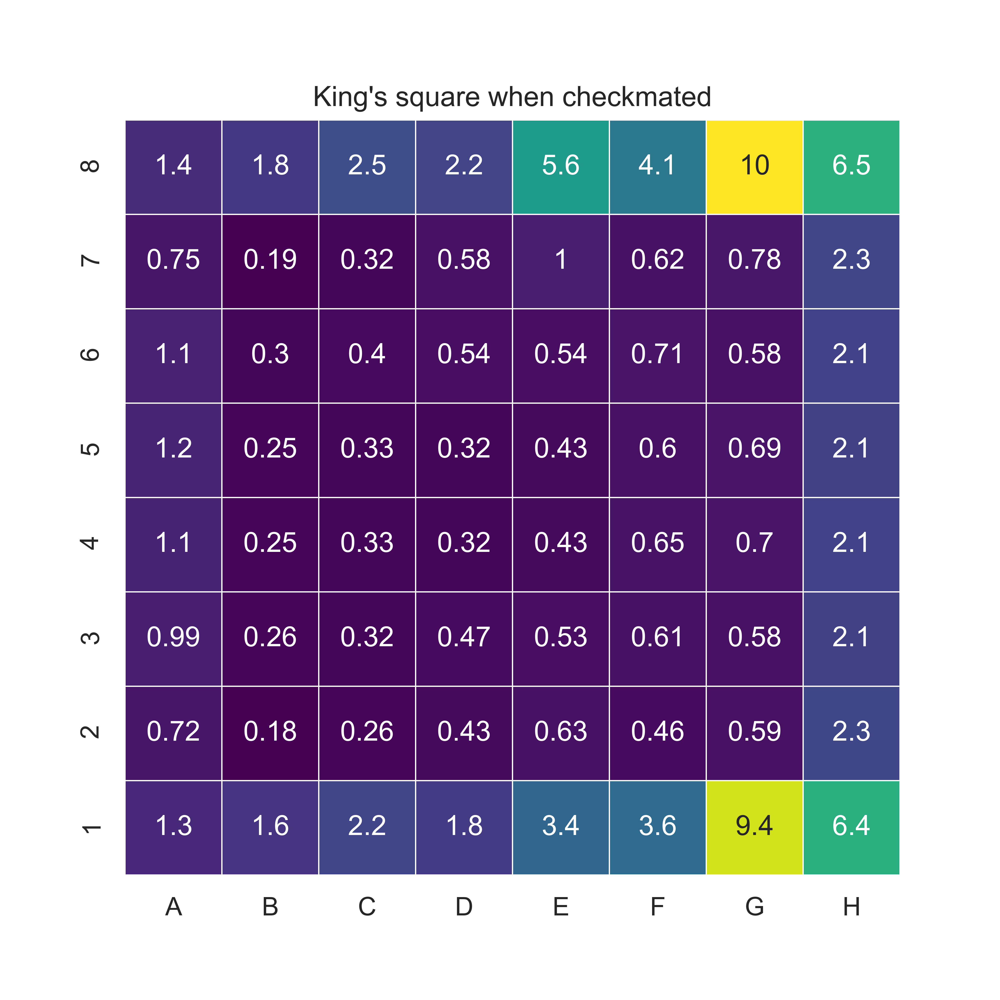

## What is this?

`find_checkmate_squares.py` is a script that iterates through a file of pgns and finds the king's square when it is checkmated. I got the file of pgns from [https://database.lichess.org/](https://database.lichess.org/) (files need to be decompressed). I used the script to check 1MM games, which took about an hour. The script outputs `checkmate_squares.csv`.

`checkmate_squares.ipynb` is a jupyter notebook in which I heatmap the results in `checkmate_squares.csv` using the Seaborn library. Outputs below.

